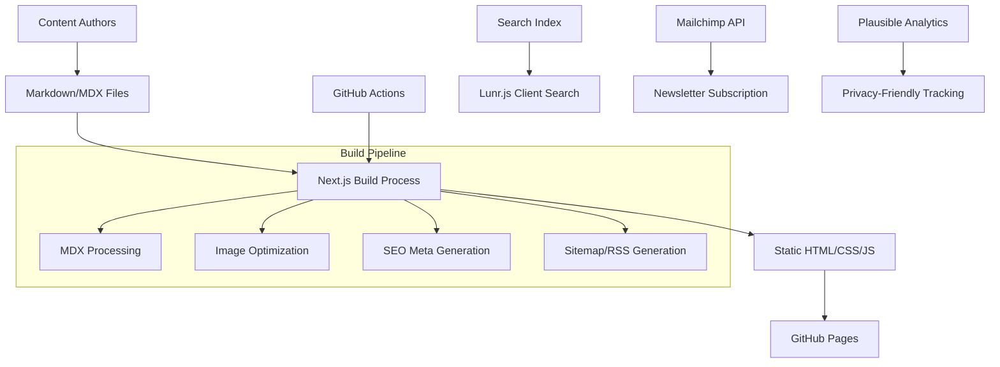

# CryptoPulse Website Design Document

## Overview

CryptoPulse is a high-performance static crypto-news website built with Next.js 14+ using the App Router and static export functionality. The architecture prioritizes performance, SEO, and user experience while maintaining zero hosting costs through GitHub Pages deployment. The design leverages modern web technologies including TypeScript, Tailwind CSS, and MDX for content management, with client-side search and privacy-compliant analytics.

## Architecture

### Technology Stack

- **Framework**: Next.js 14+ with App Router and static export
- **Language**: TypeScript for type safety and developer experience
- **Styling**: Tailwind CSS with custom design system
- **Content**: MDX with gray-matter for front-matter parsing
- **Search**: Lunr.js for client-side full-text search
- **Analytics**: Plausible Analytics (privacy-friendly)
- **Deployment**: GitHub Actions → GitHub Pages
- **Email**: Mailchimp embedded forms with double opt-in

### System Architecture



### Directory Structure

```
cryptopulse-website/
├── .github/
│   └── workflows/
│       └── deploy.yml
├── public/
│   ├── images/
│   ├── icons/
│   └── robots.txt
├── src/
│   ├── app/
│   │   ├── globals.css
│   │   ├── layout.tsx
│   │   ├── page.tsx
│   │   ├── articles/
│   │   │   ├── [slug]/
│   │   │   │   └── page.tsx
│   │   │   └── page.tsx
│   │   ├── tags/
│   │   │   └── [tag]/
│   │   │       └── page.tsx
│   │   ├── search/
│   │   │   └── page.tsx
│   │   ├── privacy/
│   │   │   └── page.tsx
│   │   ├── contact/
│   │   │   └── page.tsx
│   │   └── api/
│   │       ├── search/
│   │       ├── sitemap/
│   │       └── rss/
│   ├── components/
│   │   ├── ui/
│   │   ├── layout/
│   │   ├── article/
│   │   └── search/
│   ├── lib/
│   │   ├── mdx.ts
│   │   ├── search.ts
│   │   ├── seo.ts
│   │   └── utils.ts
│   └── types/
│       └── article.ts
├── content/
│   └── articles/
│       ├── example-article-1.mdx
│       └── ...
├── next.config.js
├── tailwind.config.js
└── package.json
```

## Components and Interfaces

### Core Data Types

```typescript
interface Article {
  slug: string;
  title: string;
  description: string;
  content: string;
  author: string;
  publishedAt: Date;
  updatedAt?: Date;
  tags: string[];
  heroImage: string;
  readingTime: number;
  featured: boolean;
}

interface SearchIndex {
  id: string;
  title: string;
  content: string;
  tags: string[];
  url: string;
}

interface SiteConfig {
  name: string;
  description: string;
  url: string;
  author: string;
  social: {
    twitter: string;
    github: string;
  };
  analytics: {
    plausibleDomain?: string;
  };
}
```

### Component Architecture

#### Layout Components
- **RootLayout**: Main layout with navigation, footer, and theme provider
- **Header**: Navigation with search toggle and theme switcher
- **Footer**: Links, newsletter signup, and social media
- **Sidebar**: Related articles and tag cloud

#### Content Components
- **ArticleCard**: Preview card for article listings
- **ArticleContent**: Full article display with TOC
- **TagBadge**: Styled tag display component
- **NewsletterForm**: Mailchimp integration component

#### Search Components
- **SearchModal**: Overlay search interface
- **SearchResults**: Results display with highlighting
- **SearchInput**: Debounced search input component

#### SEO Components
- **SEOHead**: Dynamic meta tags and structured data
- **OpenGraphImage**: Automatic OG image generation
- **BreadcrumbSchema**: JSON-LD breadcrumb markup

## Data Models

### Article Front Matter Schema

```yaml
title: "Bitcoin Reaches New All-Time High"
description: "Analysis of Bitcoin's latest price surge and market implications"
author: "John Crypto"
publishedAt: "2024-01-15"
updatedAt: "2024-01-16"
tags: ["bitcoin", "price-analysis", "market-trends"]
heroImage: "/images/bitcoin-ath-2024.jpg"
featured: true
category: "analysis"
readingTime: 5
```

### Search Index Structure

The search index will be generated at build time and include:
- Article title and content (processed and tokenized)
- Tags and categories for filtering
- URL slugs for navigation
- Metadata for result display

### SEO Data Structure

Each page will generate:
- Standard meta tags (title, description, keywords)
- Open Graph metadata for social sharing
- Twitter Card data
- JSON-LD structured data for articles
- Canonical URLs and alternate language tags

## Error Handling

### Build-Time Error Handling
- **MDX Parsing Errors**: Validate front matter and content structure
- **Image Processing**: Handle missing or invalid images gracefully
- **Search Index**: Ensure search index generation doesn't break build
- **External Dependencies**: Fallback for failed external API calls

### Runtime Error Handling
- **Search Failures**: Graceful degradation when search is unavailable
- **Newsletter Signup**: Clear error messages for failed subscriptions
- **Theme Switching**: Persist theme preference across sessions
- **404 Handling**: Custom 404 page with search and navigation

### Performance Error Handling
- **Image Loading**: Progressive loading with fallbacks
- **JavaScript Failures**: Ensure core content remains accessible
- **Network Issues**: Offline-first approach for cached content

## Testing Strategy

### Unit Testing
- **Component Testing**: React Testing Library for UI components
- **Utility Functions**: Jest for MDX processing, search, and SEO utilities
- **Type Safety**: TypeScript strict mode for compile-time error catching

### Integration Testing
- **Build Process**: Automated testing of static generation
- **Search Functionality**: End-to-end search workflow testing
- **Newsletter Integration**: Mock Mailchimp API responses

### Performance Testing
- **Lighthouse CI**: Automated performance auditing in GitHub Actions
- **Core Web Vitals**: Monitoring LCP, FID, and CLS metrics
- **Bundle Analysis**: Webpack bundle analyzer for optimization

### Accessibility Testing
- **Automated Testing**: axe-core integration for WCAG compliance
- **Manual Testing**: Keyboard navigation and screen reader testing
- **Color Contrast**: Automated contrast ratio validation

### SEO Testing
- **Meta Tag Validation**: Ensure proper meta tag generation
- **Structured Data**: JSON-LD schema validation
- **Sitemap Generation**: Verify sitemap accuracy and completeness

## Performance Optimization

### Build-Time Optimizations
- **Image Optimization**: Next.js Image component with WebP conversion
- **Code Splitting**: Automatic route-based code splitting
- **Tree Shaking**: Remove unused code from bundles
- **CSS Optimization**: Tailwind CSS purging and minification

### Runtime Optimizations
- **Lazy Loading**: Images and non-critical components
- **Prefetching**: Next.js automatic link prefetching
- **Caching Strategy**: Aggressive caching for static assets
- **Service Worker**: Optional offline functionality

### Content Delivery
- **GitHub Pages CDN**: Leverage GitHub's global CDN
- **Asset Optimization**: Compressed images and minified assets
- **Font Loading**: Optimized web font loading strategy
- **Critical CSS**: Inline critical CSS for faster rendering

## Security Considerations

### Content Security
- **Input Sanitization**: Sanitize MDX content during build
- **XSS Prevention**: Proper escaping in dynamic content
- **HTTPS Enforcement**: GitHub Pages automatic HTTPS

### Privacy Compliance
- **GDPR Compliance**: Privacy-friendly analytics without cookies
- **Data Minimization**: Collect only necessary user data
- **Consent Management**: Clear privacy policy and opt-in mechanisms
- **Third-Party Scripts**: Minimize external script dependencies

## Deployment Strategy

### GitHub Actions Workflow
1. **Trigger**: Push to main branch or manual dispatch
2. **Setup**: Node.js environment and dependency installation
3. **Build**: Next.js static export generation
4. **Test**: Run Lighthouse CI and accessibility tests
5. **Deploy**: Push to gh-pages branch
6. **Notify**: Optional deployment notifications

### Environment Configuration
- **Development**: Local development with hot reloading
- **Staging**: Preview deployments for pull requests
- **Production**: GitHub Pages with custom domain support

### Monitoring and Analytics
- **Plausible Analytics**: Privacy-friendly visitor tracking
- **GitHub Actions**: Build and deployment monitoring
- **Lighthouse CI**: Continuous performance monitoring
- **Error Tracking**: Client-side error reporting (optional)

## Scalability Considerations

### Content Scaling
- **Build Performance**: Incremental static regeneration for large content volumes
- **Search Scaling**: Client-side search limitations and alternatives
- **Image Management**: Automated image optimization pipeline

### Traffic Scaling
- **CDN Utilization**: GitHub Pages global distribution
- **Caching Strategy**: Long-term caching for static assets
- **Performance Budgets**: Monitoring and alerting for performance regressions

### Maintenance Scaling
- **Content Workflow**: Streamlined article creation and editing process
- **Automated Updates**: Dependabot for dependency management
- **Documentation**: Comprehensive setup and maintenance guides